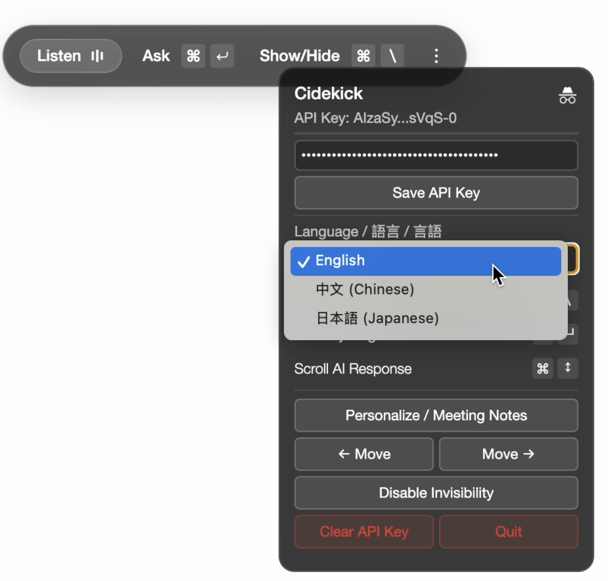

<p align="center">
  English | <a href="README_ZH.md">中文</a>
</p>

<p align="center">
  <a href="https://www.cympotek.com">
   
  </a>

  <h1 align="center">Cidekick: Your AI Assistant for Manufacturing</h1>

</p>

> This project is a fork of [Glass](https://github.com/pickle-com/glass), with modifications and enhancements. Thanks to [Soham](https://x.com/soham_btw) and all the open-source contributors who made this possible!

🤖 **Your AI assistant for manufacturing.** Cidekick analyzes schematics, identifies components from images, live video, or meetings, and helps streamline your entire production workflow.

To have fun building with us, feel free to create a pull request or open an issue.

## Quick Start (Local Build)

### Prerequisites

First download & install [Node](https://nodejs.org/en/download).

If you are using Windows, you need to also install [Build Tools for Visual Studio](https://visualstudio.microsoft.com/downloads/)

Ensure you're using Node.js version 20.x.x to avoid build errors with native dependencies.

```bash
# Check your Node.js version
node --version

# If you need to install Node.js 20.x.x, we recommend using nvm:
# curl -o- https://raw.githubusercontent.com/nvm-sh/nvm/v0.39.0/install.sh | bash
# nvm install 20
# nvm use 20
```

### Installation

```bash
npm run setup
```

## Highlights

### Component Identification


## Multi-Language Support

Currently supports English, Chinese (中文), and Japanese (日文). 



### Ask: get answers based on all your previous screen actions & audio


### Capture Screen for advice like the manufacturing assistant


### Use your own OpenAI API key

Apply from [Google AI Studio](https://aistudio.google.com/).

Or You can visit [OpenAI API](https://platform.openai.com/api-keys) to get your OpenAI API Key.

## Keyboard Shortcuts

`Ctrl/Cmd + \` : show and hide main window

`Ctrl/Cmd + Enter` : ask AI using all your previous screen and audio

`Ctrl/Cmd + Arrows` : move main window position

## Contributing

We love contributions! Feel free to open issues for bugs or feature requests.

## About Cidekick

**Our mission is to build a living digital assistant for everyone.** Cidekick is a trusted pipeline that transforms your daily data into actionable insights. Visit [www.cympotek.com](https://www.cympotek.com) to contact us.