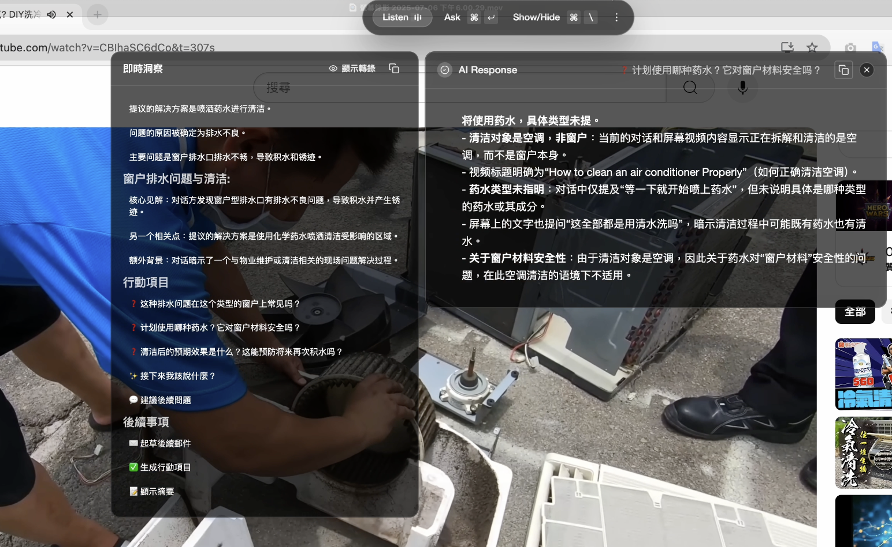

<p align="center">
  English | <a href="README_ZH.md">中文</a>
</p>

<p align="center">
  <a href="https://www.cympotek.com">
   
  </a>

  <h1 align="center">Cidekick: Your AI assistant for manufacturing</h1>

</p>


<p align="center">
  <a href="https://discord.gg/UCZH5B5Hpd"></a>&ensp;<a href="https://cidekick.com"></a>&ensp;<a href="https://x.com/intent/user?screen_name=leinadpark"></a>
</p>

> This project is a fork of [CheatingDaddy](https://github.com/sohzm/cheating-daddy) with modifications and enhancements. Thanks to [Soham](https://x.com/soham_btw) and all the open-source contributors who made this possible!

🤖 **Your AI assistant for manufacturing.** Cidekick analyzes schematics, identifies components from images or live video, and helps streamline your entire production workflow.

To have fun building with us, join our [Discord](https://discord.gg/UCZH5B5Hpd)!

## Instant Launch

⚡️  Skip the setup—launch instantly with our ready-to-run macOS app.  [[Download Here]](https://www.dropbox.com/scl/fi/znid09apxiwtwvxer6oc9/Cidekick_latest.dmg?rlkey=gwvvyb3bizkl25frhs4k1zwds&st=37q31b4w&dl=1)

## Quick Start (Local Build)

### Prerequisites

First download & install [Python](https://www.python.org/downloads/) and [Node](https://nodejs.org/en/download).
If you are using Windows, you need to also install [Build Tools for Visual Studio](https://visualstudio.microsoft.com/downloads/)

Ensure you're using Node.js version 20.x.x to avoid build errors with native dependencies.

```bash
# Check your Node.js version
node --version

# If you need to install Node.js 20.x.x, we recommend using nvm:
# curl -o- https://raw.githubusercontent.com/nvm-sh/nvm/v0.39.0/install.sh | bash
# nvm install 20
# nvm use 20
```

### Installation

```bash
npm run setup
```

## Highlights

### Component Identification




Support Multi-lang. Now can support English / 中文(Chinese) / 日文(Japan). 


### Ask: get answers based on all your previous screen actions & audio


### Capture Screen for advice like the manufacturing assistant


### Use your own OpenAI API key, or sign up to use ours (free)


You can visit [here](https://platform.openai.com/api-keys) to get your OpenAI API Key.

## Keyboard Shortcuts

`Ctrl/Cmd + \` : show and hide main window

`Ctrl/Cmd + Enter` : ask AI using all your previous screen and audio

`Ctrl/Cmd + Arrows` : move main window position

## Contributing

We love contributions! Feel free to open issues for bugs or feature requests.

## About Cidekick

**Our mission is to build a living digital assistant for everyone.** Cidekick is a trusted pipeline that transforms your daily data into actionable insights. Visit [cidekick.com](https://cidekick.com) to learn more.

## Star History
[](https://www.star-history.com/#cidekick/cidekick&Date)