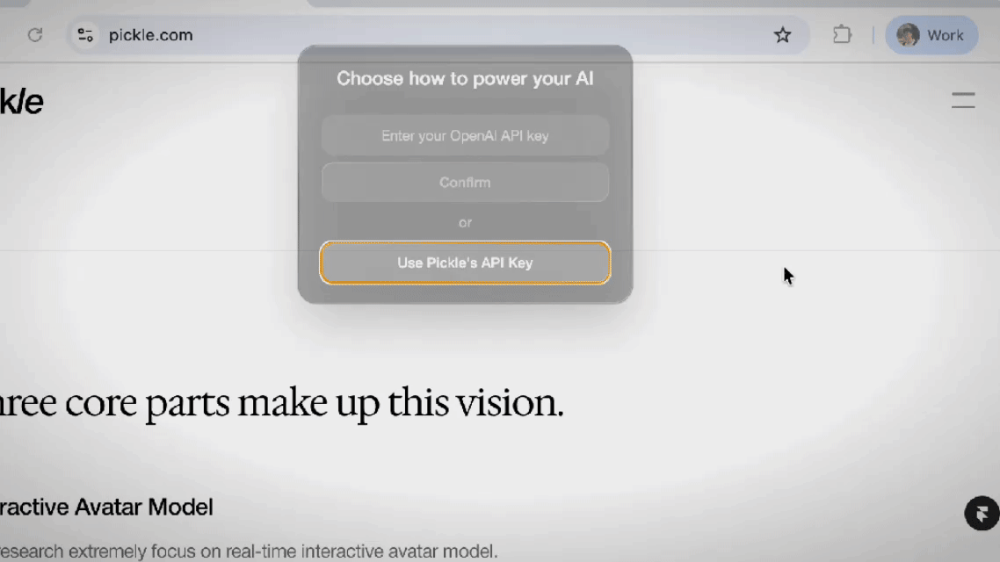

<p align="center">
  <a href="README.md">English</a> | 中文
</p>

<p align="center">
  <a href="https://www.cympotek.com">
   
  </a>

  <h1 align="center">Cidekick：您的AI製造業助理</h1>

</p>


<p align="center">
  <a href="https://discord.gg/UCZH5B5Hpd"></a>&ensp;<a href="https://cidekick.com"></a>&ensp;<a href="https://x.com/intent/user?screen_name=leinadpark"></a>
</p>

> 本專案為 [CheatingDaddy](https://github.com/sohzm/cheating-daddy) 的一個分支，並在其基礎上進行了修改和增強。感謝 [Soham](https://x.com/soham_btw) 以及所有讓此專案成為可能的開源貢獻者！

🤖 **您的AI製造業助理。** Cidekick能分析電路圖、從圖片或即時影像中識別組件，並協助您簡化整體生產流程。

與我們一起享受開發的樂趣，歡迎加入我們的 [Discord](https://discord.gg/UCZH5B5Hpd)！

## 立即啟動

⚡️ 免去設定，立即使用我們隨裝即用的 macOS 應用程式。[[點此下載]](https://www.dropbox.com/scl/fi/znid09apxiwtwvxer6oc9/Cidekick_latest.dmg?rlkey=gwvvyb3bizkl25frhs4k1zwds&st=37q31b4w&dl=1)

## 快速入門（本地建置）

### 先決條件

首先下載並安裝 [Python](https://www.python.org/downloads/) 和 [Node](https://nodejs.org/en/download)。
如果您使用 Windows，您還需要安裝 [Visual Studio 的建置工具](https://visualstudio.microsoft.com/downloads/)。

請確保您使用的是 Node.js 20.x.x 版本，以避免原生相依性套件的建置錯誤。

```bash
# 檢查您的 Node.js 版本
node --version

# 如果您需要安裝 Node.js 20.x.x，我們建議使用 nvm：
# curl -o- https://raw.githubusercontent.com/nvm-sh/nvm/v0.39.0/install.sh | bash
# nvm install 20
# nvm use 20
```

### 安裝

```bash
npm run setup
```

## 功能亮點

### 零件識別


支援多國語言。現在支援英文／中文／日文。


### 提問：根據您先前所有的螢幕操作與音訊內容獲得解答


### 擷取畫面以獲得製造助理般的建議


### 使用您自己的 OpenAI API 金鑰，或註冊使用我們的（免費）



您可以前往 [此處](https://platform.openai.com/api-keys) 取得您的 OpenAI API 金鑰。

## 鍵盤快捷鍵

`Ctrl/Cmd + \`：顯示和隱藏主視窗

`Ctrl/Cmd + Enter`：使用您先前所有的螢幕和音訊內容向 AI 提問

`Ctrl/Cmd + 方向鍵`：移動主視窗位置

## 貢獻

我們歡迎各種貢獻！若有錯誤回報或功能請求，請隨時提出問題。

## 關於 Cidekick

**我們的使命是為每個人打造一個活生生的數位助理。** Cidekick 是一個值得信賴的管道，能將您的日常數據轉化為可行的見解。請造訪 [cidekick.com](https://cidekick.com) 以了解更多資訊。

## Star 歷史
[](https://www.star-history.com/#cidekick/cidekick&Date) 